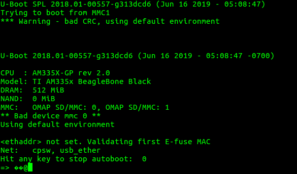
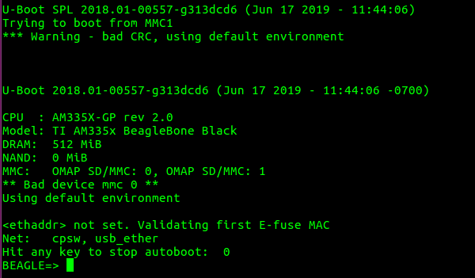
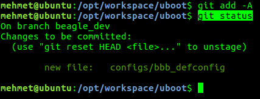
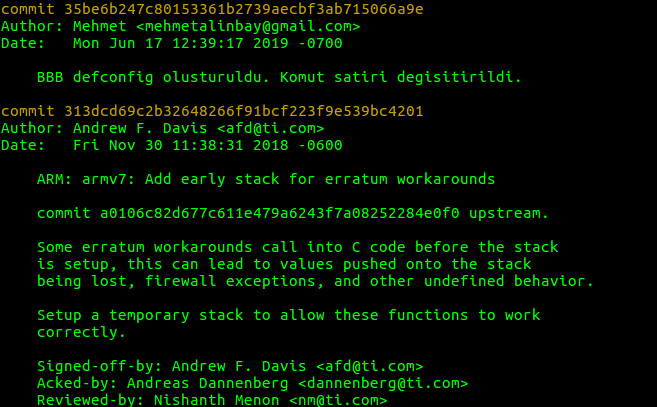
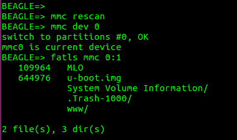

# U-Boot Derleme

## U-Boot Edinme

U-Boot indirmek için iki adet kaynağımız var. Denx veya BBB işlemcisinin üreticisi olan Texas Instruments (TI) websitelerinden. 

TI; tekrar etmeke gerekirse Processor SDK adı altında U-Boot ve Linux için kaynaklarından aldığı snapshotların üzerine kendi işlemcileri için ek geliştirmeler koyarak dağıtımını yapmaktadır. Esas hedefimiz **endüstriyel** olduğu için ben TI'nin sağladığı U-Boot ve Linux kaynak kodlarını kullanmayı tercih ediyorum. 

Biz yine de Denx'den indirmenin komutunu verelim.
~~~~
git clone git://git.denx.de/u-boot.git
~~~~

Peki TI'dan nasıl indireceğiz? Bunun için iki yol var. 

1. TI Processor SDK (Toolchain kurma bölümünde anlatıldı) 
2. git.ti.com 'dan indirme

TI GIT üzerinden indirerek işlemlerimizi yapalım.

~~~~
cd /opt/workspace
git clone git://git.ti.com/ti-u-boot/ti-u-boot.git uboot
cd uboot/
~~~~

GIT ile indirdiğimiz için birçok branch bulunacaktır. Önce branchlere bakalım 
~~~
git branch -a
~~~

Biz çalışmalarımızı **Processor SDK 5.03'e** paralellik göstermesi için **2018.01** branch ile yapalım.

~~~
git checkout ti-u-boot-2018.01
~~~

Bu noktada işlerin karışmaması için kendi branchimizi oluşturmamız gerekiyor. Branch ismi **beagle_dev** olsun. 

~~~
git checkout -b beagle_dev
~~~

Yaptığımız kontrol edelim.

~~~
git status
~~~

>On branch beagle_dev
>nothing to commit, working directory clean

Artık U-Boot üzerinde yapacağımız tüm değişiklikler git tarafından takip edilecek.

## U-Boot Derleme

Temelde Linux, U-Boot, Buildroot derlemek için en gerekli dosya **config** dosyasıdır. Eğer bir boarda ilk defa derleme yapıyorsanız başlangıç için çalışan bir `config` dosyası bulunmaz bir nimettir (özellikle Çin tabanlı işlemcilerle olan kartlarda)

`config` dosyaları U-Boot içerisinde `configs/` altında bulunur. Bu klasörün içinde bazı kartlar için `config` dosyaları bulunmaktadır. 

Eğer sizin kartınız ile ilgili `config` dosyası bulamazsanız internetten aramanız gerekiyor yada gözünüzün kestirdiği bir `config` ile şansınızı deneyebilirsiniz. 

~~~
ls /opt/workspace/uboot/configs
~~~

Biz derlememizi Processor SDK [dökümanında](http://software-dl.ti.com/processor-sdk-linux/esd/docs/latest/linux/Foundational_Components_U-Boot.html#general-information) yazdığı üzere BBB uyumlu olan `am335x_evm_config` dosyası ile yapacağız.
~~~
cd /opt/workspace/uboot
make am335x_evm_config
~~~

Yukarıdaki komutu yürüttüğümüzde U-Boot `am335x_evm_config` dosyasına göre ayarlanır. Aslında yapılan işlem U-Boot ana klasöründe bulunan .config dosyasını güncellemektir. 

Kontrol edelim.

~~~
make menuconfig
~~~

Resimde görüldüğü üzere U-Boot 2018.01 versiyonda ve ARM çekirdek için derleme yapacak.

Peki bir derleme yapalım.

~~~~
export CC=/opt/workspace/sdk/gcc-linaro-7.3.1-2018.05-x86_64_arm-linux-gnueabihf/bin/arm-linux-gnueabihf-
make ARCH=arm CROSS_COMPILE=$CC -j4
~~~~

Toolchain olarak Linaro'dan indirdiğimiz toolchain'i kullandık ve `CROSS_COMPILE=$CC` ile toolchain'i bildiriyoruz. 

`ARCH=arm` parametresi ile derlememizi ARM çekirdek ile yapacağımızı bildiriyoruz.

`-j4` parametresi ile derleme için kaç çekirdek kullanılacağını bildiriyoruz. Eğer ilk defa derleme yapıyorsanız bu parametreyi kullanmayın. Bu sayede derleme hatalarını görmemiz daha kolay olacaktır.

Derlememiz başarılı ise çıktılar uboot klasörü altında olacaktır. Bizim işimize yarayacak dosyalar `MLO` ve `u-boot.img` dosyalarıdır. 

`MLO` Rom Bootloader tarafından çağrılacak olan SPL yani ön U-Boot yükleyicisidir. 

`u-boot.img` ise isminden de çıkarabileceğimiz üzere U-Boot'un kendisidir.

`MLO` ile `u-boot.img` dosyalarının boyutlarına bakmanızı tavsiye ederim.

[SD-Kartı hazırlama](sdcard_prepare) ile kartımızı hazırlayalım. `MLO` ve `u-boot.img` dosyalarını diskin `boot` bölümüne kopyalayalım. 

Eğer işleri doğru yürüttüysek U-Boot UART üzerinden bize mesajlar gönderecektir. SD-Kartı takalım, [UART konsol bağlantısını](uart_console_setup) yapalım ve picocom'dan verileri izleyelim. 

Eğer UART konsoldan mesajlar geliyorsa, herhangi bir tuş ile sistemin bootunu durduralım.  
Şöyle birşeyler görmemiz gerekiyor.

Mesajlarda görüldüğü üzere öncelikle SPL yükleniyor daha sonra U-Boot yüklenmekte.

Mesajlarda derleme tarih ve saati yazmaktadır. Özellikle geliştirme aşamasında işe yarar bir bilgi olabiliyor.

Eğer U-Boot'un otomatik boot prosesini durdurmamış olsaydık U-Boot dahili ortam değişkenlerine bağlı olarak çeşitli yerlerde (MMC0, SPI, Ethernet vs.) Linux çekirdeği arayacaktı, bulamayacağı için ekrana bir tomar mesaj basacaktı ve en sonunda kendi konsoluna düşecekti.

Bu aşamada yapmamız gereken son iş ise bir adet uEnv.txt hazırlamak ve onu kopyalamak.

## Örnek-1: U-Boot Komut Satırı Değiştirme

İndirdiğimiz U-Boot içerisinde gelen config içinde basit bir değişiklik yapalım, kaydedelim ve bunu patch olarak kaydedelim.

Yapacağımız değişiklik komut satırının başında bulunan `=>` ibaresini değiştirelim. Bu oldukça basit bir değişiklik olup sadece görünüşte olan bir değişikliktir, U-Boot'un çalışmasını etkilemez.

Öncelikle Cross-Compiler tanıtılır ve menuconfig ile menüye girilir.

~~~~
export CC=/opt/workspace/sdk/gcc-linaro-7.3.1-2018.05-x86_64_arm-linux-gnueabihf/bin/arm-linux-gnueabihf-
make ARCH=arm menuconfig
~~~~
Menüde aşağıdaki şekilde değişiklik yapılır.
> Command line interface  --->  
(BEAGLE=> ) Shell prompt 

Tekrar derleyelim ve SD-Karta yükleyeyelim. Ekrana gelen mesajlar şu şekilde olmalı.

~~~
make ARCH=arm CROSS_COMPILE=$CC -j4
~~~

Yaptığımız değişiklik çalışmış gözüküyor. Peki bu değişikliği nasıl kaydedeceğiz ve patch haline getireceğiz?

Öncelikle kaydetmek için aşağıdaki komutu kullanırız. 
~~~
make savedefconfig
~~~
Bu komut ile üzerinde çalışmış olduğumuz `.config` dosyası `defconfig` dosyası olarak U-Boot ana klasörü altında kaydedilir. `defconfig` dosyasını `configs/` klasörü altında istediğimiz bir isimle kopyalayalım. Genellikle xxx_defconfig formatı takip edilmekte bizde bbb_defconfig diyelim.

~~~
mv defconfig configs/bbb_defconfig
~~~

Peki git tarafından yapılan değişikliklere bakalım
~~~
git status
~~~

Resimde görüldüğü üzere kopyaladığımız bbb_defconfig dosyası yeni bir dosya olarak gözükmekte ancak `defconfig` dosyası U-Boot git ayarları nedeniyle görmezden gelinmektedir. Bunun nedeni her git reposu içerisinde bir adet `.gitignore` dosyası bulunur ve bu dosya hangi dosya/klasörlerin görmezden gelineceğini bildirir. Bu dosyayı açıp incelemenizi tavsiye ederim.

Bu yeni dosyayı git'e ekleyelim ve ilk commit'imizi yapalım.

~~~
git add -A
git status
~~~

Dosyamız artık git akışı içinde yani bu dosyada ileride yapılacak değişiklikler de artık git tarafından takip edilecek. 

~~~
git commit -m "BBB defconfig olusturuldu. Komut satiri degisitirildi."
~~~

İlk commitimizi yaptık. Commitlerin genelde yeteri kadar açıklayıcı olmasına dikkat edin. Commitlerde genelde İngilizce karakter kullanıyorum, tabii tercih meselesi.

Yaptığımızı kontrol edelim.

~~~
git log
~~~

Resimde görüldüğü üzere yaptığımız değişiklik commit olarak geçmişte yapılan değişikliklerden sonra gözükmektedir.

Son olarak yama oluşturalım.

~~~
git format-patch --binary -o patches/ ti-u-boot-2018.01
~~~

Yama oluşturmak için birkaç komut var ancak ben bunu tercih ediyorum. Bu komut ile `ti-u-boot-2018.01` noktasından itibaren gelen tüm değişiklikleri (commitleri), yama olarak `patches/` klasörü altına koyacağız. `patches/` klasörü görmezden gelinen klasörler arasındadır bu sayede sonsuz bir döngüden kurtulmuş oluruz.

`git format-patch` komutu her biri commiti ayrı bir patch dosyası olarak saklar.

## Örnek-2: MMC Driver Model Özelliğinin Kapatılması

SD kart içindeki dosyalara U-Boot komut satırından bakmaya çalıştığımda SD kartın bulamadığını gördüm. Buradaki en büyük saçmalık SPL U-Boot'u SD karttan yüklüyordu ancak *nedense* U-Boot SD kartı bulamıyordu. 

Sorunun çözümü (https://e2e.ti.com/support/processors/f/791/t/662382) için önerilen ise MMC Driver Model özelliğinin kapatılmasıydı. Bana **2 güne** mal olan bu çözümü uygulayalım.

~~~~
export CC=/opt/workspace/sdk/gcc-linaro-7.3.1-2018.05-x86_64_arm-linux-gnueabihf/bin/arm-linux-gnueabihf-
make ARCH=arm menuconfig
~~~~

Menüde `> Device Drivers > MMC Host controller Support` altında bulunan `Enable MMC controllers using Driver Model` seçeneğini kapatalım ve derleme yapalım.

~~~
make ARCH=arm CROSS_COMPILE=$CC -j4
~~~

MLO ve u-boot.img dosyalarını SD Karta kopyalayalım, kartı çalıştıralım. U-Boot başladığında ise herhangi bir tuşa basarak konsoldan durduralım.

U-Boot komut satırında sırasıyla şu komutları çalıştıralım.

>mmc rescan  
mmc dev 0  
fatls mmc 0:1

U-Boot çıktısı şuna benze birşeyler olmalı.

`mmc rescan` komutu işlemcinin MMC cihazların taraması için kullanılır.  
`mmc dev 0`  komutu ile 0 nolu (SD Kart) MMC cihazına geçilir. 1 nolu cihaz kart üstünde bulunan eMMC'dir. 
`fatls mmc 0:1` komutu ile 0 nolu MMC cihazın 1. bölümünün içindekiler listelenir. 1. bölüm FAT32, 2.nci bölüm EXT4 olarak formatladığımız bölümdü.

Son olarak bu değişikliği de yama haline getirelim.

~~~
make savedefconfig
mv defconfig configs/bbb_defconfig
git add -A
git commit -m "SD Kart okuma sorunu nedeniyle MMC Driver Model kapatildi."
git format-patch --binary -o patches/ ti-u-boot-2018.01
~~~

//TODO patchler nerede saklanacak.
